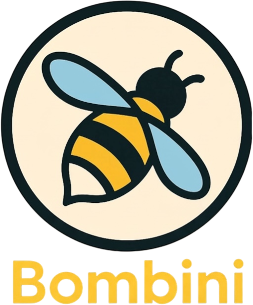

# Bombini: eBPF-based Security Monitoring and Sandboxing Agent



![License][license-badge]
[![CI][ci-badge]][ci-url]
[![Book][book-badge]][book-url]

[license-badge]: https://img.shields.io/badge/license-Apache--2.0-0078D4?style=for-the-badge
[ci-badge]: https://img.shields.io/github/actions/workflow/status/bombinisecurity/bombini/ci.yaml?branch=main&style=for-the-badge
[ci-url]: https://github.com/bombinisecurity/bombini/actions/workflows/ci.yaml
[book-badge]: https://img.shields.io/badge/read%20the-book-9cf.svg?style=for-the-badge&logo=mdbook
[book-url]: https://bombinisecurity.github.io/bombini/

**Bombini** is an eBPF-based security agent written entirely in Rust using the
[Aya](https://github.com/aya-rs/aya) library and built on LSM (Linux Security Module) BPF hooks.
At its core, Bombini employs modular components called Detectors, each responsible for
monitoring and reporting specific types of system events. Detectors with sandbox mode
enabled also block forbidden actions right in the kernel.

## Why Bombini

* **Filters in the kernel.** Rules are compiled into eBPF maps and evaluated by the eBPF
  programs, so only matching events reach userspace.
* **Blocks in the kernel, not after the fact.** Sandbox rules are enforced by LSM BPF hooks:
  a forbidden exec, file open or connection fails with `EPERM` instead of being reported
  once it has already happened.
* **One rule language for detection and enforcement.** The same `scope`/`event` predicates
  either report an event or, with `sandbox` enabled, deny it.
* **Sees what syscall tracing misses.** IOUringMon inspects io_uring submissions, and
  KernelMon reports BPF program and map activity.
* **Easy to ship.** A single static musl binary plus BPF objects, available as a container
  image, a Kubernetes DaemonSet with pod metadata enrichment, or a tarball with a systemd unit.

## Quickstart

Bombini needs Linux 6.2+ with BPF LSM enabled. Check the [compatibility](./docs/src/compatibility.md)
notes first. The container image is built for x86_64.

Start Bombini with the [quickstart](./examples/quickstart) config from the repository root:

```bash
docker run --pid=host --rm -it --privileged \
  -v $PWD/examples/quickstart:/usr/local/lib/bombini/config:ro \
  -v /sys/fs/bpf:/sys/fs/bpf \
  ghcr.io/bombinisecurity/bombini:v1.1.0
```

The config consists of three detector files.

[`procmon.yaml`](./examples/quickstart/procmon.yaml) reports setuid to root and forbids
executing anything from `/tmp`:

```yaml
# Detect privilege escalation to root
setuid:
  enabled: true
  rules:
    - rule: SetUidToRoot
      event: euid == 0

# Block binaries executed from /tmp right in the kernel
bprm_check:
  enabled: true
  sandbox:
    enabled: true
    deny_list: true
  rules:
    - rule: DenyExecFromTmp
      event: path_prefix == "/tmp"
```

[`filemon.yaml`](./examples/quickstart/filemon.yaml) reports reads of `/etc/shadow`:

```yaml
# Detect reads of password hashes
file_open:
  enabled: true
  rules:
    - rule: ShadowRead
      event: path == "/etc/shadow"
```

[`netmon.yaml`](./examples/quickstart/netmon.yaml) reports connections to the cloud
metadata service:

```yaml
# Detect access to the cloud metadata service: a common way to steal credentials
egress:
  enabled: true
  rules:
    - rule: CloudMetadataAccess
      event: ipv4_dst == "169.254.169.254" AND port_dst == 80
```

Generate events in another terminal:

```console
$ ./examples/quickstart/trigger.sh
[1] sudo reads /etc/shadow: Setuid and FileOpen events
[2] exec a binary from /tmp: blocked by the sandbox
./examples/quickstart/trigger.sh: 10: /tmp/bombini-quickstart: Operation not permitted
    blocked: exit code 126
[3] connect to the cloud metadata service: Egress event
```

Bombini prints events to stdout as JSON lines. This is the blocked exec:

```json
{
  "type": "ProcessEvent",
  "process": {
    "start_time": "2026-10-03T14:36:10.256Z",
    "cloned": true,
    "pid": 39988,
    "tid": 39988,
    "ppid": 39984,
    "uid": 503,
    "euid": 503,
    "gid": 1000,
    "egid": 1000,
    "auid": 0,
    "cap_inheritable": "",
    "cap_permitted": "",
    "cap_effective": "",
    "secureexec": "",
    "filename": "dash",
    "binary_path": "/usr/bin/dash",
    "args": "./examples/quickstart/trigger.sh",
    "exec_id": "Mzk5ODg6MjEyNzU3NDAzMjI2MzI2",
    "parent_exec_id": "Mzk5ODQ6MjEyNzU3MzgzNTY5NTc3"
  },
  "parent": { "...": "same fields for the parent process" },
  "blocked": true,
  "process_event": {
    "type": "BprmCheck",
    "binary": "/tmp/bombini-quickstart"
  },
  "timestamp": "2026-10-03T14:36:10.256Z",
  "rule": "DenyExecFromTmp"
}
```

More ready-made policies, such as [GTFOBins](./examples/procmon-gtfobins.yaml) shell escapes
and [privilege escalation](./examples/procmon-privilege-raise.yaml), are in [examples](./examples).

## Detectors

| Detector | What it watches | Sandbox |
|----------|-----------------|:-------:|
| [ProcMon](./docs/src/configuration/procmon.md) | Process execs and exits, setuid/setgid, capabilities, prctl, user namespaces, ptrace | ✓ |
| [FileMon](./docs/src/configuration/filemon.md) | File open, mmap, truncate, unlink, symlink, chmod, chown, mount, ioctl | ✓ |
| [NetMon](./docs/src/configuration/netmon.md) | Ingress and egress TCP connections, socket creation and connect | ✓ |
| [KernelMon](./docs/src/configuration/kernelmon.md) | BPF map creation, BPF program loads, and access to BPF maps and programs | |
| [IOUringMon](./docs/src/configuration/io_uringmon.md) | io_uring submission queue entries | |
| [SysEnumMon](./docs/src/configuration/sysenummon.md) (experimental) | System enumeration: several watched files or binaries touched within a time window | |

The rule syntax is described in [Rules](./docs/src/configuration/rules.md), and the event
format in [Events](./docs/src/events/events.md).

## Installation

* [Container](./docs/src/getting_started/container.md)
* [Kubernetes](./docs/src/getting_started/k8s.md)
* [Tarball with systemd](./docs/src/getting_started/tarball.md)
* [Build from source](./docs/src/getting_started/build.md)

Full documentation is in the [book](https://bombinisecurity.github.io/bombini/).

## Contributing

Please, check out [CONTRIBUTING.md](./CONTRIBUTING.md) for the contributing guideline.
