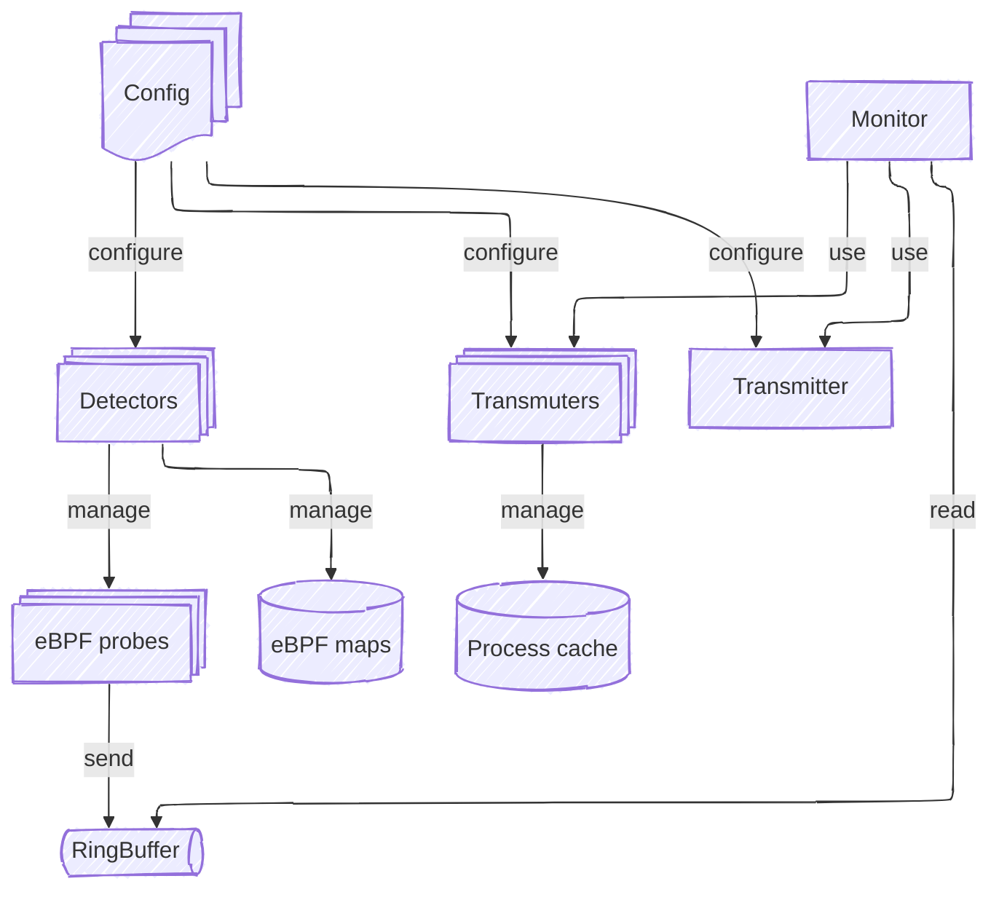
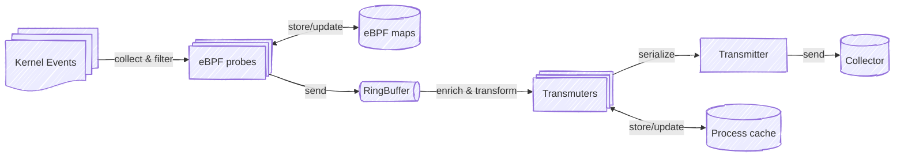

# Overview

Consider the design concepts through flowcharts below:

* architecture flowchart
* event transformation flowchart

## Architecture Flowchart

### Detector

Detector provides a common interface for loading / unloading eBPF programs, initializing
maps and attaching programs to hook points. EBPF part of detectors is
located
[here](https://github.com/anfedotoff/bombini/tree/main/bombini-detectors-ebpf/src/bin).
User mode part is
[here](https://github.com/anfedotoff/bombini/tree/main/bombini/src/detector). Detectors
can share information between each other storing it in eBPF maps.
Some parts of detectors can be reused across different detectors.
Detectors submit events to user space using ring buffer. Detectors use YAML
config files for initialization. Detectors are stored in Registry.

### Transmuter

Transmuter provides a common interface to convert (transmute) low kernel events into serializable data structures (e.g. json).
Transmuters can enrich kernel events with some user mode data and implement different
types of caching. Transmuters are stored in TransmuterRegistry. One Detector can have many types of Transmuters,
but usually it has only one.

### Transmitter

Transmitter sends serialized events (byte arrays) to different sources (unix socket, stdout, file, etc).

### Monitor

Monitor observes new low level kernel events (messages) and extracts them from ring buffer. According to event type,
it fetches corresponding transmuter to convert and enrich eBPF event. Further transmuted events are send to destination with
transmitter.

### Config

Config provides all information about Bombini setup. It also holds options of bombini cli and
config for each detector to be loaded. Detector's configs are also provided for corresponding transmuters. 

## Event Transformation Flowchart

### Filters

Filters are applied to eBPF events inside eBPF probes in order to decide will be event exposed to user space or not.
A detailed description of the filtering can be found directly in the description of the corresponding detector.

## Process Execution Detection

### eBPF

Process information (ProcInfo) is stored in `PROCMON_PROC_MAP` which is shared across all detectors.
Map entries are updated with tracepoints: `sched_process_exec`, `sched_process_fork`, `sched_process_exit`, and
`security_bprm_comitting_creds` LSM BPF hook. This hook is used to collect binary_path with `bpf_d_path` helper and IMA binary
hash collection. `sched_process_fork` - creates an entry and sends `ProcessClone` event, entries are created only for thread leaders (pid == tgid).
It means that Bombini doesn't track thread creation, but in tracks events (e.g. file open, etc.) in threads. In this case, event will hold
process information about its thread leader.
`sched_process_exec` - updates entries and sends `ProcessExec`.
`sched_process_exit` - mark entry as "exited" for the garbage collector and sends `ProcessExit` event.

### User Space

In Bombini there are three event types related to process execution: `ProcessExec`, `ProcessClone`, and `ProcessExit`.
These events are provided by corresponding Transmuters. Also, they maintain a `ProcessCache` to hold serializable `Process`
structures that are used in all event types. `ProcessClone` event creates an entry in ProcessCache. `ProcessExit` event marks
entry as "exited" for cache garbage collection. `ProcessExec` event marks as "exited" Process cache entry, related to previous
clone() or exec() calls and puts new Process entry in cache.